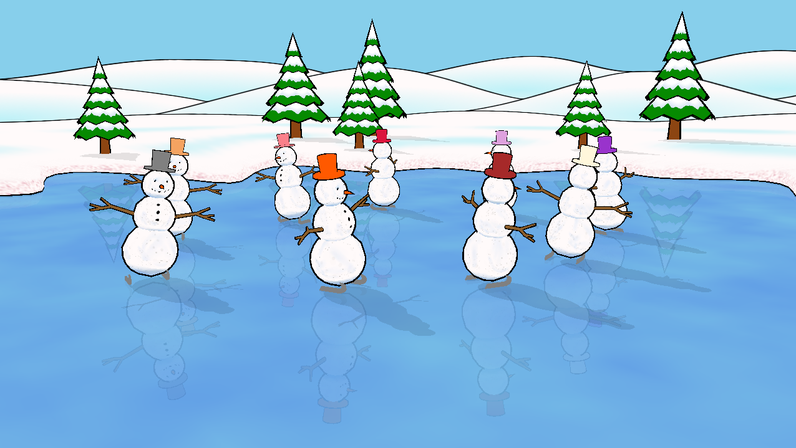

# Snowmen fork of xscreensaver

This is a fork of xscreensaver (forked from xscreensaver-6.09) I created to implement my addition to it.

The Snowmen screensaver looks like this:

The goal was to create a scene similar to the skating scene from "A Charlie Brown Christmas". I was going for a hand-drawn cartoon style. For that I wanted the bold outlines and mostly flat colors you see in the screenshot above. To get this effect I didn't use any lighting, and I kept my textures subtle.

## Changes

### 2024-November 8:

* Replaced the large ice texture file with a Perlin noise generator.
* Removed the texture header file `snowmen_textures.h`, and added texture image files.

### 2023-November 24:

* Initial public release.

## Relevant files

### The Snowmen screensaver source code:
* `hacks/glx/snowmen.c`

### The Snowmen screensaver textures:
* `hacks/images/snowmen_base.png`
* `hacks/images/snowmen_head.png`
* `hacks/images/snowmen_hill.png`
* `hacks/images/snowmen_shore.png`
* `hacks/images/snowmen_torso.png`
* `hacks/images/snowmen_tree.png`

## For more information about xscreensaver:

See the [original README](README_orig.txt) file from the xscreensaver source code for licensing, installation, etc. (I renamed the original so that you would see **this** README instead when you visit my fork on GitHub.)